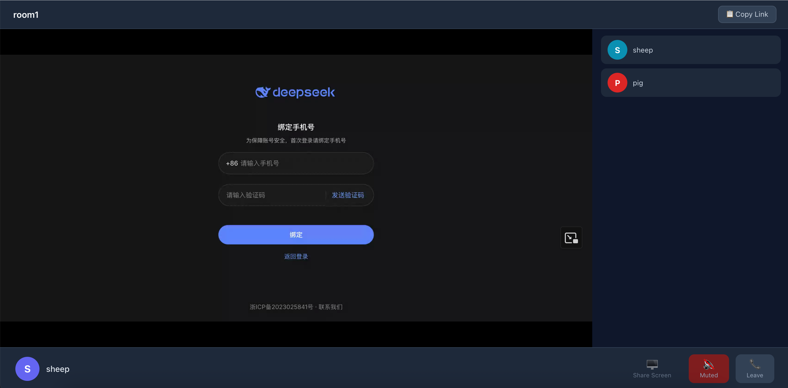

<p align="center">
  
  
  
</p>

# 🎙️ Less Meeting

**轻量级在线语音会议系统** / *Lightweight Online Voice Conference System*

[中文](#中文) · [English](#English)

---

## 中文

### 简介

Less Meeting 是一个从零构建的轻量级在线语音会议系统。整个项目使用 **[CodeWhale](https://github.com/Hmbown/CodeWhale)** 终端工具配合 **[deepseek-v4-pro](https://www.deepseek.com/)** 模型，以 **Vibe Coding** 方式完成开发——从设计架构、搭建骨架、调试信令、修复音频路由到实现屏幕共享，全程 AI 辅助。

**核心功能：**

- 🎤 多人实时语音通话（基于 Mediasoup SFU）
- 🖥️ 屏幕共享（VP8 视频编码，高度自适应）
- 🗣️ 说话人检测（RMS 音量分析 + 高亮提示）
- 🔇 麦克风静音 / 取消静音
- 🔗 一键生成分享链接，参会者通过直链加入
- 🌐 中英文双语界面（根据浏览器语言自动切换）
- 📱 响应式布局，移动端可用

---

### 安装与部署

#### 本地开发

```bash
# 1. 确保 Node.js >= 22
node -v

# 2. 安装依赖
npm install
cd client && npm install && cd ..

# 3. 构建前端
cd client && npm run build && cd ..

# 4. 启动服务端
npm run dev

# 5. 浏览器访问 http://localhost:3000
```

> 开发前端时如需热更新，可额外打开终端运行 `cd client && npm run dev`（端口 3001）。

#### 生产部署（Docker）

详见 [DEPLOY.md](./DEPLOY.md)。简要步骤：

```bash
# 1. 配置公网 IP
cp .env.example .env
vim .env   # 设置 ANNOUNCED_IP=你的公网IP

# 2. 生成 HTTPS 证书（二选一）
bash gen-certs.sh                              # 自签名证书
# 或 certbot certonly --standalone -d DOMAIN   # Let's Encrypt

# 3. 构建并启动
docker compose up -d --build
```

> ⚠️ **必须配置 HTTPS**：浏览器仅在安全上下文中允许麦克风访问。

---

### 使用方式

1. 打开 `https://你的域名`，输入房间名 → 点击「创建新房间」
2. 复制会议链接分享给参会者
3. 参会者点击链接，输入昵称 → 点击「加入会议」
4. 授权麦克风权限后即可实时语音通话
5. 点击「共享屏幕」按钮可将桌面共享给所有参会者

---

### 截图

<p align="center">
  
</p>

---

### 技术栈

| 层级 | 技术 | 版本 |
|------|------|------|
| **语言** | TypeScript | ^5.6 |
| **运行时** | Node.js | ≥22.10 |
| **SFU 媒体服务器** | Mediasoup | ^3.19 |
| **信令 / WebSocket** | ws | ^8.18 |
| **HTTP 服务** | Express | ^4.21 |
| **前端构建** | Vite | ^6.0 |
| **WebRTC 客户端** | mediasoup-client | ^3.7 |
| **容器化** | Docker + Compose | — |
| **反向代理 / SSL** | Nginx (alpine) | — |
| **开发运行时** | tsx | ^4.19 |

**架构概览：**

```
浏览器 (Chrome/Edge/Firefox)
    │  WebSocket 信令 + WebRTC (UDP)
    ▼
Nginx (HTTPS :443, WSS 代理)
    │
    ▼
Express + ws (:3000 内部)
    │
    ▼
Mediasoup Worker → Router → Transport → Producer/Consumer
    │
    ▼
UDP 40000-49999 (RTP 媒体流)
```

---

### 项目结构

```
less-meeting/
├── src/                     # 服务端
│   ├── index.ts             # 入口（Express + WebSocket）
│   ├── config.ts            # 全局配置
│   ├── types.ts             # 类型定义 + 信令协议
│   ├── mediasoup/           # SFU 配置（Worker/Router/Codec）
│   ├── room/                # 房间管理
│   ├── signaling/           # WebSocket 信令处理
│   └── utils/               # 工具函数
├── client/                  # 前端（Vite + TypeScript）
│   └── src/
│       ├── i18n.ts          # 国际化（中/英）
│       ├── media.ts         # Mediasoup 客户端封装
│       ├── ws.ts            # WebSocket 信令客户端
│       └── pages/           # Lobby / Meeting 页面
├── public/                  # 构建产物（Express 托管）
├── nginx.conf               # Nginx HTTPS + WSS 配置
├── Dockerfile               # 多阶段构建
├── docker-compose.yml       # 容器编排
├── gen-certs.sh             # 自签名证书生成
└── DEPLOY.md                # 部署详细指南
```

---

## English

### Overview

Less Meeting is a lightweight online voice conference system built from scratch. The entire project was developed using **[CodeWhale](https://github.com/Hmbown/CodeWhale)** with the **[deepseek-v4-pro](https://www.deepseek.com/)** model in a **Vibe Coding** workflow — from architecture design, scaffolding, signaling debugging, audio routing fixes, to screen sharing implementation.

**Core Features:**

- 🎤 Multi-party real-time voice calls (Mediasoup SFU)
- 🖥️ Screen sharing (VP8 video, height-adaptive scaling)
- 🗣️ Active speaker detection (RMS analysis + visual highlight)
- 🔇 Mute / unmute microphone
- 🔗 One-click shareable meeting links
- 🌐 Bilingual UI (auto-detected from browser language)
- 📱 Responsive layout, mobile-friendly

---

### Installation & Deployment

#### Local Development

```bash
# 1. Node.js >= 22 required
node -v

# 2. Install dependencies
npm install
cd client && npm install && cd ..

# 3. Build frontend
cd client && npm run build && cd ..

# 4. Start server
npm run dev

# 5. Open http://localhost:3000
```

> For frontend hot-reload during development, run `cd client && npm run dev` in a separate terminal (port 3001).

#### Production (Docker)

See [DEPLOY.md](./DEPLOY.md) for details. Quick start:

```bash
cp .env.example .env
vim .env   # Set ANNOUNCED_IP=your_public_ip
bash gen-certs.sh                            # Self-signed cert
# OR certbot certonly --standalone -d DOMAIN # Let's Encrypt
docker compose up -d --build
```

> ⚠️ **HTTPS is required**: browsers block microphone access on non-secure contexts.

---

### Usage

1. Open `https://your-domain`, enter a room name → click **Create New Room**
2. Copy the meeting link and share with participants
3. Participants open the link, enter their nickname → click **Join Meeting**
4. Grant microphone permission to start real-time voice calls
5. Click **Share Screen** to broadcast your desktop

---

### Screenshots

<p align="center">
  
</p>

---

### Tech Stack

| Layer | Technology | Version |
|-------|-----------|---------|
| **Language** | TypeScript | ^5.6 |
| **Runtime** | Node.js | ≥22.10 |
| **SFU Media Server** | Mediasoup | ^3.19 |
| **Signaling / WebSocket** | ws | ^8.18 |
| **HTTP Server** | Express | ^4.21 |
| **Frontend Bundler** | Vite | ^6.0 |
| **WebRTC Client** | mediasoup-client | ^3.7 |
| **Containerization** | Docker + Compose | — |
| **Reverse Proxy / SSL** | Nginx (alpine) | — |
| **Dev Runtime** | tsx | ^4.19 |

**Architecture:**

```
Browser (Chrome/Edge/Firefox)
    │  WebSocket signaling + WebRTC (UDP)
    ▼
Nginx (HTTPS :443, WSS proxy)
    │
    ▼
Express + ws (:3000 internal)
    │
    ▼
Mediasoup Worker → Router → Transport → Producer/Consumer
    │
    ▼
UDP 40000-49999 (RTP media streams)
```

---

### Project Structure

```
less-meeting/
├── src/                     # Server
│   ├── index.ts             # Entry (Express + WebSocket)
│   ├── config.ts            # Global config
│   ├── types.ts             # Type definitions + signaling protocol
│   ├── mediasoup/           # SFU config (Worker/Router/Codec)
│   ├── room/                # Room management
│   ├── signaling/           # WebSocket signaling handlers
│   └── utils/               # Utilities
├── client/                  # Frontend (Vite + TypeScript)
│   └── src/
│       ├── i18n.ts          # Internationalization (zh/en)
│       ├── media.ts         # Mediasoup client wrapper
│       ├── ws.ts            # WebSocket signaling client
│       └── pages/           # Lobby / Meeting pages
├── public/                  # Build output (served by Express)
├── nginx.conf               # Nginx HTTPS + WSS config
├── Dockerfile               # Multi-stage build
├── docker-compose.yml       # Container orchestration
├── gen-certs.sh             # Self-signed cert generator
└── DEPLOY.md                # Detailed deployment guide
```

---

<p align="center">
  <sub>Built with ❤️ using <a href="https://github.com/Hmbown/CodeWhale">CodeWhale</a> + <a href="https://www.deepseek.com/">deepseek-v4-pro</a></sub>
</p>
